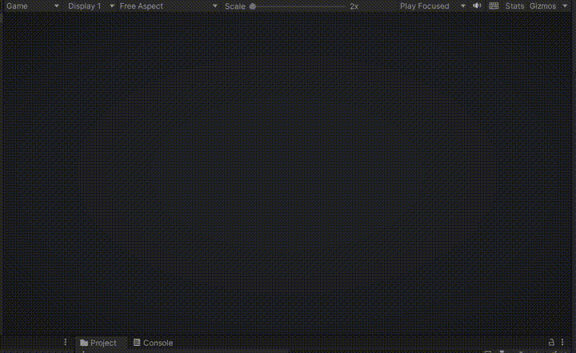

# Maze generator

This is a prototype of a maze generator for learning purposes. The solution is based on this tutorial: [Original tutorial](https://www.youtube.com/watch?v=gHU5RQWbmWE).

## How it works

This solution uses Depth-First-Search to find and connect all the rooms in the grid.
